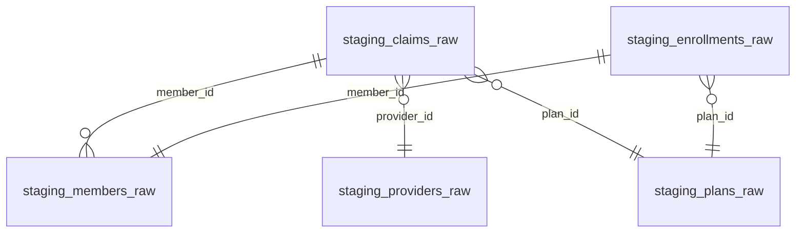
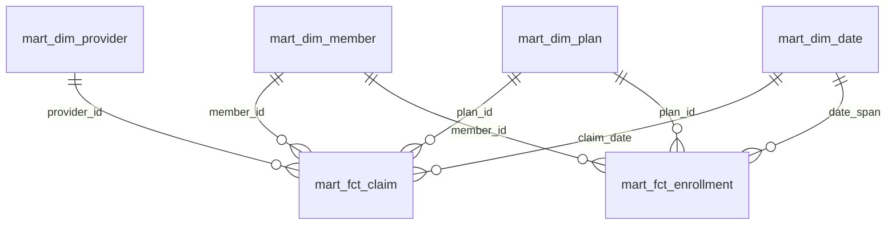
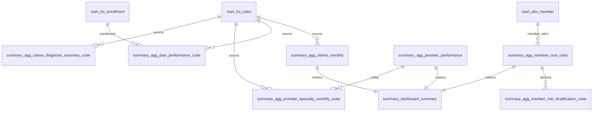
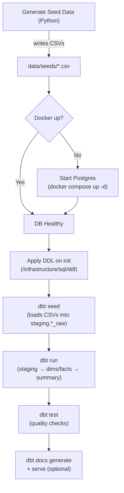

# aca_health

## overview

Create datawarehouse, from raw to semantic layer, to serve as foundation for cost analyzer.

[Data Dictionary](https://garthmortensen.github.io/aca_health/).

## Execution

### 1. Generate health insurance seed data

Generate synthetic seed data:

```bash
python scripts/generate_seed_data.py
```

This creates:

- **Timestamped CSVs** in `data/seeds/` (for archival/versioning)
- **Stable-named CSVs** in `transform/seeds/` (for dbt seed to load)

### 2. Create database

Launch Postgres container:

```bash
docker compose -f infrastructure/docker/docker-compose.yml up -d
```

On first run, this:

- Creates database `aca_health`
- Runs DDL scripts from `infrastructure/sql/ddl/`
- Creates empty `staging.*_raw` tables

### 3. Load and transform with dbt

```bash
cd transform

# Load CSV seeds into staging.*_raw tables
dbt seed --full-refresh

# Run transformations (staging → mart → summary)
dbt run

# Run data quality tests
dbt test

# Or run everything at once
dbt build
```

## transform

Use dbt to perform all transformations including stage, star-schema analytics mart, summary tables, data cubes and semantic layer.

### Data Models

Models are organized into the following schemas:

Install dbt package dependencies:

```bash
dbt deps
```

Run snapshots (captures SCD2 changes for members / plans / providers):

```bash
dbt snapshot
```

Build everything (models + tests).

```bash
dbt build
# or separate:
dbt run
dbt test
```

Gen docs:

```bash
dbt docs generate
dbt docs serve  # opens a local web server
```

Produce single-file static docs for GitHub Pages

```bash
python make_static_docs.py
```

Select executions:

```bash
dbt run --select staging

dbt run --select mart
```

`dbt build` is the one command to materialize all layers + tests.

## Tools

- Containerization: Docker + docker-compose
- Packaging: uv
- Transform modeling: dbt
- Data QA: dbt_expectations (Great Expectations)
- data creation: faker
- linting: Ruff, SQLFluff

## Schema ERDs

## Staging



- Cardinality marks: `||` (one), `o{` (many optional).

## Mart (curated dims & facts)



## Summary (aggs and cubes)



- `source` edges indicate aggregation lineage.
- `metrics feed` indicates inputs to composite dashboard view.
- `derived` indicates a second-level cube built from a first-level cube.

## Data Architecture & Materialization Strategy

The data warehouse follows a modern ELT pattern with dbt-native seed loading and different materialization strategies based on data characteristics:

```text
SEEDS (CSV)       STAGING           SNAPSHOTS            DIMENSIONS           FACTS
──────────        ─────────         ──────────           ──────────           ─────────
members.csv    ─► members_raw    ─► member_snapshot   ─► dim_member    ────┐
(dbt seed)        (TABLE)           (SCD2 table)         (VIEW)              │
                                                                             │
plans.csv      ─► plans_raw      ─► plan_snapshot     ─► dim_plan      ────┤
(dbt seed)        (TABLE)           (SCD2 table)         (VIEW)              │
                                                                             │
providers.csv  ─► providers_raw  ─► provider_snapshot ─► dim_provider  ────┤  fct_claim
(dbt seed)        (TABLE)           (SCD2 table)         (VIEW)              ├─► (INCREMENTAL)
                                                                             │
claims.csv     ─► claims_raw     ──────────────────────────────────────────┤
(dbt seed)        (TABLE)                                                    │
                                                                             │
enrollments.csv─► enrollments_raw ─────────────────────────────────────────┤  fct_enrollment
(dbt seed)        (TABLE)                                                    └─► (INCREMENTAL)

generate_series() ──────────────────────────────────► dim_date ──────────┘
(SQL function)                                         (TABLE)
```

### Materialization Types

| Layer | Type | Strategy | Rationale |
|-------|------|----------|-----------|
| **Seeds** | `table` | dbt seed loads CSVs | Idempotent data loading from source files |
| **Staging** | `view` | Deduplicate and clean | Lightweight transformation layer |
| **Facts** | `incremental` | Append new records only | High-volume transactional data |
| **Business Dimensions** | `view` | Current records from snapshots | Change tracking with clean interface |
| **Reference Dimensions** | `table` | Static lookup data | Performance for heavily-joined reference data |
| **Snapshots** | `snapshot` | SCD2 history tracking | Preserve full change history |

### Benefits

- **Simplicity**: dbt seed provides idempotent CSV loading without custom Python
- **Lineage**: Full data lineage visible in dbt docs (seeds → staging → marts)
- **Performance**: Facts materialized as tables for fast aggregations
- **Flexibility**: Dimensions as views enable easy current vs. historical queries  
- **Efficiency**: Incremental loading processes only new/changed data
- **Auditability**: Full change history preserved in snapshot tables

## End-to-end local workflow

The diagram shows: generate seeds → start Postgres → load with dbt seed → build/test with dbt → docs.



### Typical commands

```bash
# 1. Generate synthetic seeds (creates timestamped + stable-named CSVs)
python scripts/generate_seed_data.py

# 2. Start Postgres (first run applies DDL automatically)
docker compose -f infrastructure/docker/docker-compose.yml up -d

# 3. Build and validate with dbt
cd transform

# Option A: All-in-one command
dbt build

# Option B: Step-by-step
dbt seed --full-refresh  # Load CSVs into staging tables
dbt snapshot            # Capture SCD2 changes
dbt run                 # Run transformations
dbt test                # Run data quality tests
dbt docs generate       # Generate documentation (optional)
dbt docs serve          # Serve docs locally (optional)
```

## dbt profile setup

dbt looks for `~/.dbt/profiles.yml` by default. This repo includes a working profile at `transform/profiles/profiles.yml` named `aca_health` (matching `profile:` in `transform/dbt_project.yml`).

Set it up once globally:

```bash
mkdir -p ~/.dbt
cp transform/profiles/profiles.yml ~/.dbt/profiles.yml
```

Validate the profile and connection:

```bash
cd transform
dbt debug
```
