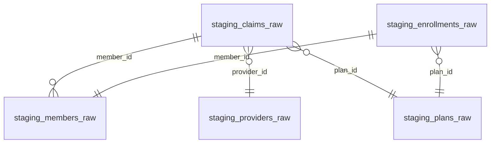
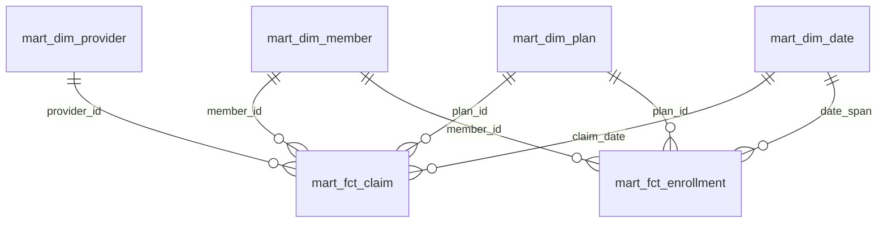
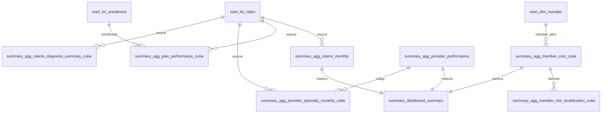
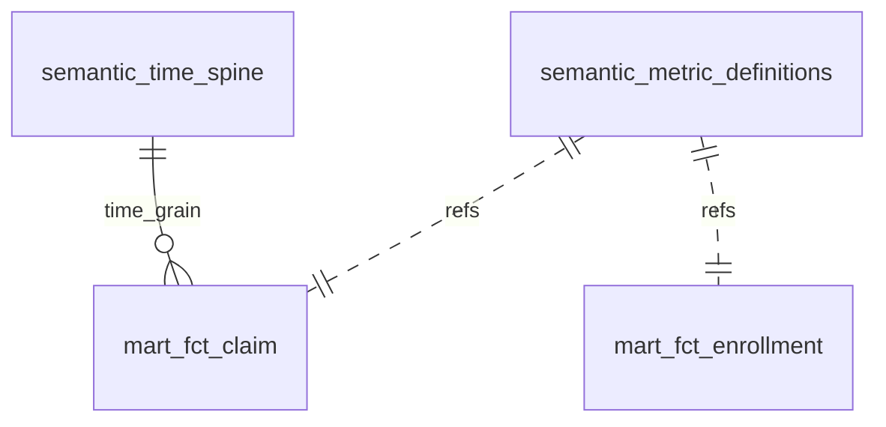

# aca_health

## overview

Create datawarehouse, from raw to semantic layer, to serve as foundation for cost analyzer.

[Data Dictionary](https://garthmortensen.github.io/aca_health/).

## Execution

### create health insurance seed data

- Generate seed data:
  - members
  - plans
  - providers
  - claims and enrollments

`python ./scripts/generate_seed_data.py`

### create database and read seeds

- launch database
- define schema on load, with data dictionary

`docker compose -f infrastructure/docker/docker-compose.yml up`

## Load Staging Data

- Load seed CSVs into staging tables 1:1.
- No transforms — just type coercion + basic validation.
- Track load batch metadata:
  - `load_id`
  - `load_timestamp`

`python scripts/staging_loader.py`

## transform

Use dbt to perform all transformations including stage, star-schema analytics mart, summary tables, data cubes and semantic layer.

Install dbt package dependencies:

```bash
dbt deps
```

Run snapshots (captures SCD2 changes for members / plans / providers):

```bash
dbt snapshot
```

Build everything (models + tests).

```bash
dbt build
# or separate:
dbt run
dbt test
```

Gen docs:

```bash
dbt docs generate
dbt docs serve  # opens a local web server
```

Produce single-file static docs for GitHub Pages

```bash
python make_static_docs.py
```

Select executions:

```bash
dbt run --select staging

dbt run --select mart
```

`dbt build` is the one command to materialize all layers + tests.

## Tools

- Containerization: Docker + docker-compose
- Packaging: uv
- Transform modeling: dbt
- Data QA: dbt_expectations (Great Expectations)
- data creation: faker
- linting: Ruff, SQLFluff

## ERDs

## Staging Schema



- Cardinality marks: `||` (one), `o{` (many optional).

## Mart Schema (curated dims & facts)



## Summary Schema



- `source` edges indicate aggregation lineage.
- `metrics feed` indicates inputs to composite dashboard view.
- `derived` indicates a second-level cube built from a first-level cube.

## Semantic Layer


