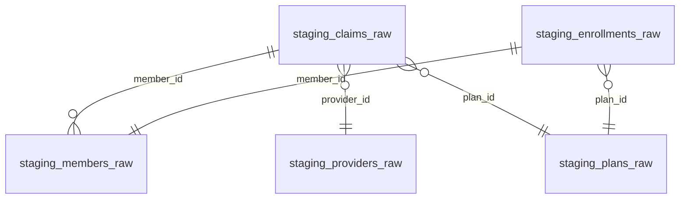
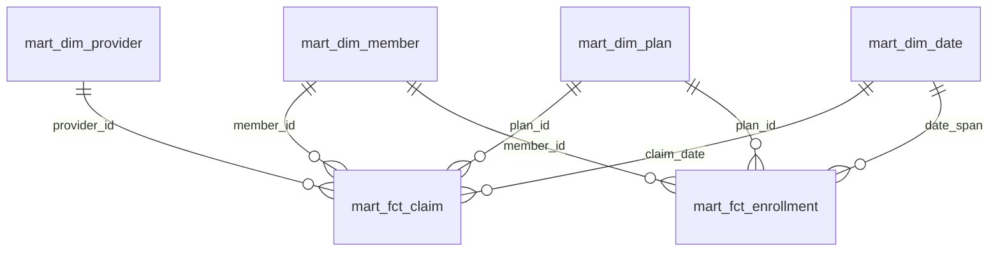
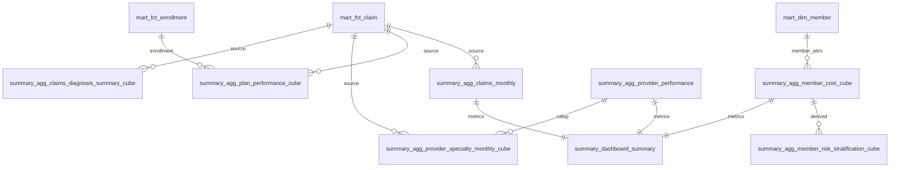
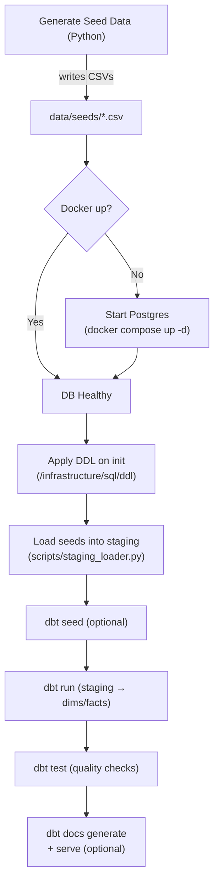

# aca_health

## overview

Create datawarehouse, from raw to semantic layer, to serve as foundation for cost analyzer.

[Data Dictionary](https://garthmortensen.github.io/aca_health/).

## Execution

### create health insurance seed data

- Generate seed data:
  - members
  - plans
  - providers
  - claims and enrollments

`python ./scripts/generate_seed_data.py`

### create database and read seeds

- launch database
- define schema on load, with data dictionary

`docker compose -f infrastructure/docker/docker-compose.yml up`

## Load Staging Data

- Load seed CSVs into staging tables 1:1.
- No transforms — just type coercion + basic validation.
- Track load batch metadata:
  - `load_id`
  - `load_timestamp`

`python scripts/staging_loader.py`


## transform

Use dbt to perform all transformations including stage, star-schema analytics mart, summary tables, data cubes and semantic layer.

### Data Models

Models are organized into the following schemas:

Install dbt package dependencies:

```bash
dbt deps
```

Run snapshots (captures SCD2 changes for members / plans / providers):

```bash
dbt snapshot
```

Build everything (models + tests).

```bash
dbt build
# or separate:
dbt run
dbt test
```

Gen docs:

```bash
dbt docs generate
dbt docs serve  # opens a local web server
```

Produce single-file static docs for GitHub Pages

```bash
python make_static_docs.py
```

Select executions:

```bash
dbt run --select staging

dbt run --select mart
```

`dbt build` is the one command to materialize all layers + tests.

## Tools

- Containerization: Docker + docker-compose
- Packaging: uv
- Transform modeling: dbt
- Data QA: dbt_expectations (Great Expectations)
- data creation: faker
- linting: Ruff, SQLFluff

## Schema ERDs

## Staging



- Cardinality marks: `||` (one), `o{` (many optional).

## Mart (curated dims & facts)



## Summary (aggs and cubes)



- `source` edges indicate aggregation lineage.
- `metrics feed` indicates inputs to composite dashboard view.
- `derived` indicates a second-level cube built from a first-level cube.

## Data Architecture & Materialization Strategy

The data warehouse follows a modern ELT pattern with different materialization strategies based on data characteristics:

```text
STAGING           SNAPSHOTS            DIMENSIONS           FACTS
─────────         ──────────           ──────────           ─────────
members_raw    ─► member_snapshot   ─► dim_member    ────┐
(raw CSV)         (SCD2 table)        (VIEW)              │
                                                          │
plans_raw      ─► plan_snapshot     ─► dim_plan      ────┤
(raw CSV)         (SCD2 table)        (VIEW)              │
                                                          │
providers_raw  ─► provider_snapshot ─► dim_provider  ────┤  fct_claim
(raw CSV)         (SCD2 table)        (VIEW)              ├─► (INCREMENTAL)
                                                          │
claims_raw     ──────────────────────────────────────────┤
(raw CSV)                                                 │
                                                          │
enrollments_raw ──────────────────────────────────────────┤  fct_enrollment
(raw CSV)                                                 └─► (INCREMENTAL)

generate_series() ──────────────────► dim_date ──────────┘
(SQL function)                        (TABLE)
```

### Materialization Types

| Layer | Type | Strategy | Rationale |
|-------|------|----------|-----------|
| **Facts** | `incremental` | Append new records only | High-volume transactional data |
| **Business Dimensions** | `view` | Current records from snapshots | Change tracking with clean interface |
| **Reference Dimensions** | `table` | Static lookup data | Performance for heavily-joined reference data |
| **Snapshots** | `snapshot` | SCD2 history tracking | Preserve full change history |

### Benefits

- **Performance**: Facts materialized as tables for fast aggregations
- **Flexibility**: Dimensions as views enable easy current vs. historical queries  
- **Efficiency**: Incremental loading processes only new/changed data
- **Auditability**: Full change history preserved in snapshot tables

## End-to-end local workflow

The diagram shows: generate seeds → start Postgres → load staging → build/test with dbt → docs.



### Typical commands

```bash
# 1 Generate synthetic seeds (timestamped CSVs in data/seeds)
python3 scripts/generate_seed_data.py

# 2 Start Postgres (first run applies DDL automatically)
docker compose -f infrastructure/docker/docker-compose.yml up -d

# 3 Load the latest seed files into staging tables
python3 scripts/staging_loader.py

# 4 Build and validate with dbt
cd transform

# simple
dbt build

# piecemeal
dbt snapshot
dbt run
dbt test
dbt docs generate  # optional
```

## dbt profile setup

dbt looks for `~/.dbt/profiles.yml` by default. This repo includes a working profile at `transform/profiles/profiles.yml` named `aca_health` (matching `profile:` in `transform/dbt_project.yml`).

Set it up once globally:

```bash
mkdir -p ~/.dbt
cp transform/profiles/profiles.yml ~/.dbt/profiles.yml
```

Validate the profile and connection:

```bash
cd transform
dbt debug
```
