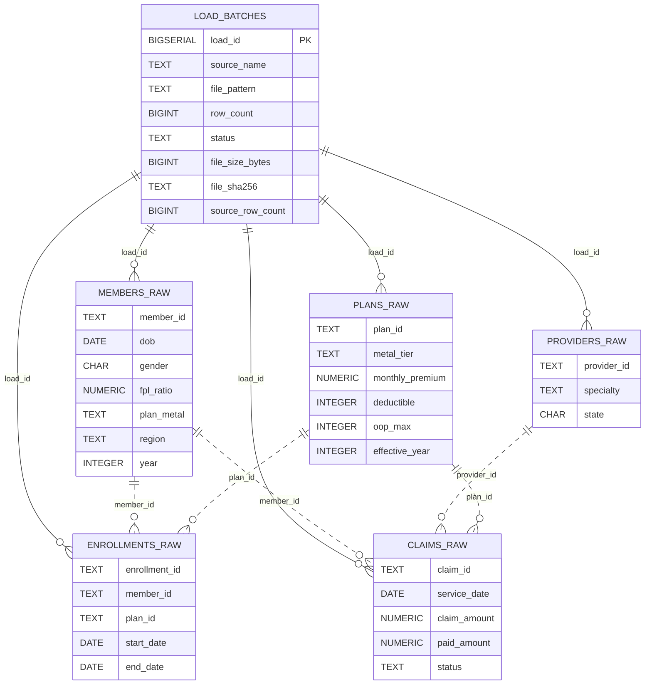

# ADR 0001: Core Dimensional & Fact Design

Simplicity prioritized over extensibility.

## Current database state



## Context

We have raw CSV data loaded into staging tables with load auditing. Need a first dimensional (Kimball-style) model plus facts to enable analytics. This is hard bc high complexity options.

## Goals

- Quick path to usable star schema (claims + enrollment analysis).
- Enable slowly changing tracking for key descriptive attributes.
- Keep load logic understandable for a newcomer.
- Provide foundation for later refinement (snapshots, bridges, mini-dims).

## Non‑Goals (Now)

- Perfect normalization of every attribute.
- Line-level claim explosion (single-line claims assumed initially).
- Mini-dim/junk dim separation, late arriving fact handling beyond basic rejection.
- Detailed diagnosis/procedure bridge modeling.

## Chosen Design (Baseline)

1. Surrogate Keys: BIGSERIAL (identity) for all dimensions. Facts store FK integers.
2. SCD2 Dimensions: Member, Plan, Provider. Date is static (no SCD). Geography deferred (inline attributes for now).
3. Natural Keys:
   - Member: member_id
   - Plan: (plan_id, effective_year)
   - Provider: provider_id (NPI retained as attribute)
4. SCD2 Columns (for SCD dims): validity_start_ts, validity_end_ts (default '9999-12-31'), current_flag, attr_hash (SHA256), load_id, created_at.
5. Change Detection: hash of ordered, trimmed business attributes (COALESCE to empty string) compared to current row's attr_hash.
6. Expiration Pattern: update old row (set validity_end_ts = now, current_flag = false) then insert new row in same transaction.
7. Date Dimension: Pre-populate full calendar range (e.g. 2018‑01‑01 .. 2030‑12‑31) once; date_key = yyyymmdd integer.
8. Facts:
   - FactClaim (grain = one claim_id row; degenerate claim_id stored; status, diagnosis_code, procedure_code kept inline).
   - FactEnrollment (grain = one continuous member-plan enrollment period from source).
9. FK Resolution: Join staging raw to current_flag=TRUE dimension rows on natural keys; reject (log) unmatched rows.
10. Idempotency: Rerunning dimension / fact loaders safe: hash comparison prevents duplicate SCD versions; facts use anti-join on natural key.
11. Error Handling: Unmatched fact natural keys logged to an error table (future); initial version may skip insertion and WARN.
12. Data Quality Minimums: row count reconciliation, duplicate natural key check in current dimension rows, FK orphan check for facts.

## Simplifications vs Earlier Options

- No mini-dims (engagement flags stay on DimMember). Can split later if churn is large.
- No separate DimGeography (state, region in DimMember & DimProvider rows).
- No claim line grain; upgrade by adding line_number and splitting measures later.
- No periodic or accumulating snapshots; derive aggregate views post-fact load.

## Example DDL Sketch (Abstract)

```
CREATE TABLE dim_member (
  member_sk BIGSERIAL PRIMARY KEY,
  member_id TEXT NOT NULL,
  first_name TEXT, last_name TEXT, dob DATE, gender CHAR(1), region TEXT,
  ... business attributes ...,
  validity_start_ts TIMESTAMPTZ NOT NULL DEFAULT now(),
  validity_end_ts   TIMESTAMPTZ NOT NULL DEFAULT '9999-12-31',
  current_flag BOOLEAN NOT NULL DEFAULT TRUE,
  attr_hash CHAR(64) NOT NULL,
  load_id BIGINT,
  created_at TIMESTAMPTZ NOT NULL DEFAULT now(),
  UNIQUE (member_id, validity_start_ts)
);
CREATE INDEX ON dim_member (member_id) WHERE current_flag;
```

## Loader Pattern (SCD2)

1. Build candidate set from latest staging load(s).
2. Normalize + compute attr_hash.
3. LEFT JOIN to current dimension rows.
4. Changed/new rows -> expire old (if any) + insert new.

## FactClaim Load Pattern

- Filter staging.claims_raw to rows with matching member, provider, plan dimension current rows.
- Resolve date_key from service_date.
- Anti-join against existing fact_claim (claim_id) to insert new.

## FactEnrollment Load Pattern

- Use staging.enrollments_raw. Resolve member_sk / plan_sk, compute coverage_days.
- Anti-join on (enrollment_id) natural key.

## Future Enhancements (Not Now)

- Claim line normalization & diagnosis/procedure bridge.
- Mini-dim for engagement flags; junk dim for sparse indicators.
- Geography dimension & conformed share to other domains.
- Periodic monthly enrollment snapshot fact.
- Late arriving fact staging & retry logic.
- Materialized views for common summaries (claims by metal tier, member utilization).

## Rationale

This strikes balance between Kimball best practices (clear grain, surrogate keys, SCD2 on volatile dimensions) and minimal complexity for a first working warehouse. Most alternative refinements can be layered without rework of existing tables.

## Consequences

- Some dimensions may grow faster due to wide SCD2 (acceptable early).
- Limited historical analysis for geography or specialty reclassification until separate dims added.
- Rebuild of facts required if grain changes (e.g., claim line) later.

## Decision

Proceed with baseline design and implement DDL + loaders accordingly.

## Review

Revisit after first incremental change simulation (second seed batch) to assess SCD2 churn and decide on mini-dim or snapshot additions.
